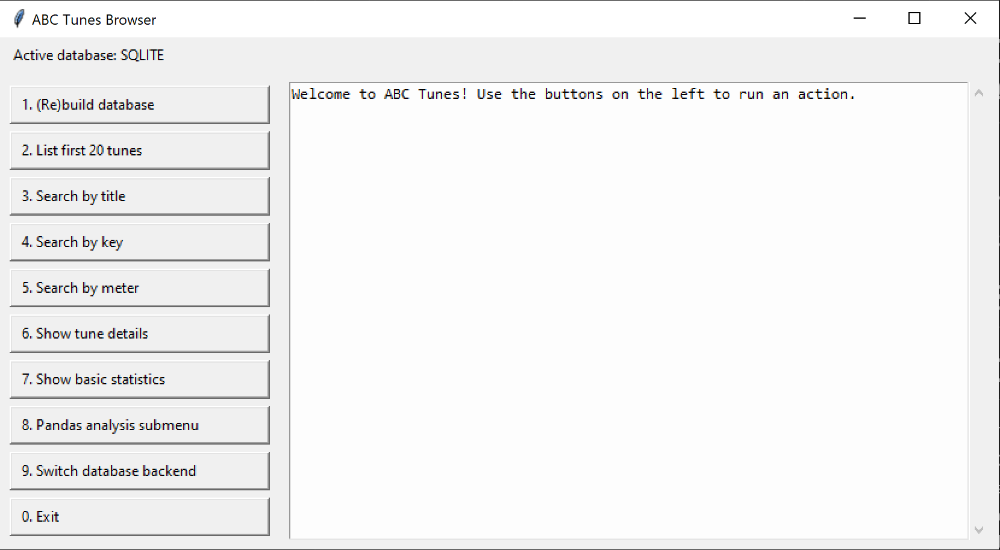
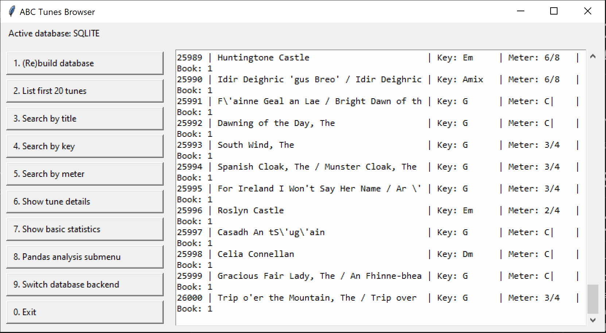
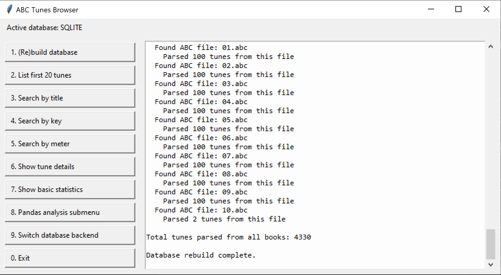
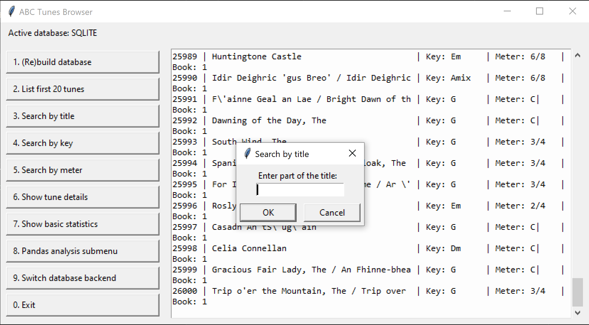

# Data Centric Programming Assignment 2025

- [Assignment Brief](assignment.md)

Name: Lea Stanisavljevic

Student Number: A00046044

# Screenshots
 
# Description of the project
This project is a small data-processing application built for the Data Centric Programming module (DATA2005).
Its main goal is to take a collection of traditional music files written in ABC notation, extract all of the individual tunes, store them in a databas and then allow the user to browse, search and analyse the tunes in an interface.

It is written in python. It uses SQLite and MySQL for the database of teh tunes. It has a simple Tkinter GUI for the user to query the database without needing to use the terminal. The GUI displays results in an output window using stdout so the same backend functions work both in console mode and in the GI.

Main Features
- file parsing
 
- a database
 
- SQL querying
 
- data analysis using pandas

- basic gui design

# Instructions for use
1. **Clone the repository** from GitHub.  
2. Install **Python 3**, then create a virtual environment.  
3. Install dependencies:

    ```bash
    pip install -r requirements.txt
    ```

4. Place the ABC music folders inside the `abc_books/` directory.  
5. Run the program:

    ```bash
    python main.py
    ```

6. The GUI will open automatically.
**(or just press the 'run python file' in VS Code)**

### Using the GUI

Use the buttons on the left to:

- rebuild the database  
- list the first 20 tunes  
- search by title  
- search by key signature  
- search by meter  
- view full tune details  
- run pandas analysis  
- switch between SQLite and MySQL  
- close the window

# How it works:
### 1. Parsing the ABC files

All `.abc` files inside `abc_books/` are scanned and parsed.

A tune begins with `X:` and may include:

- `T:` title  
- `R:` rhythm  
- `M:` meter  
- `K:` key signature  

The parser extracts all metadata and body text into a Python dictionary.

### 2. Database Storage

After parsing, tunes can be inserted into:

- **SQLite** (`tunes.db`)  
- **MySQL** (via credentials stored in `.env`)  

Both backends use the same table structure.

### 3. Querying the Tunes

Several query functions are provided:

- list the first 20 tunes  
- search by title  
- search by key signature  
- search by meter  
- show all tune details  

### 4. Data Analysis with pandas

The tunes table can be loaded into a pandas DataFrame for:

- tune counts per book  
- most common keys  
- meter and rhythm distribution  
- filtering by type or keyword  

### 5. Graphical User Interface

The interface is built with **Tkinter**.

Printed output is redirected into a scrollable Text widget using:

```python
contextlib.redirect_stdout
```

This prevents code duplication and the data is only displayed in the gui.

# List of files in the project

| Files | Source |
|-----------|-----------|
| main.py | Self written |
| db_connection.py | Modified from reference |
| db_analysis.py | Modified from reference |
| db_gui.py | Modified from reference and refined with Windsurf |
| db_query.py | Modified from reference |
| abc_parser.py | Modified from reference |
| abc_books | Provided by lecturer |
| tunes.db | Provided by lecturer |
| requirements.txt | Self written |
| .venv/venv | Self written |
| README.MD | Self written but refined with ChatGPT |

# References
* Bryan Duggan Lecture Notes and Labs
* [Advice from developers @ Give(A)Go Hackatons](https://www.giveago.co/)
* [ABC Notation](https://abcnotation.com/wiki/abc:standard:v2.1)
* [Graphical user interfaces with Tk](https://docs.python.org/3/library/tk.html)
* [GUI Window](https://www.youtube.com/watch?v=ibf5cx221hk)
* [Pandas Documentation](https://pandas.pydata.org/docs/)
* [Python Tkinter Full Course](https://www.youtube.com/watch?v=TuLxsvK4svQ)
* [Python Modules](https://docs.python.org/3/tutorial/modules.html)
* [Accessing SQLite Databases Using Python and Pandas](https://datacarpentry.github.io/python-ecology-lesson/instructor/09-working-with-sql.html)
* [pandas.read_sql](https://pandas.pydata.org/docs/reference/api/pandas.read_sql.html)
* [ACB Notion Tutorial](https://sjkabc.readthedocs.io/en/latest/tutorial.html)
* [Python Abstraction with Abstract Base Classes (ABCs) - Beginner's Guide](https://www.bing.com/videos/riverview/relatedvideo?q=phyton+acb+notation+gui&mid=AAA0213E773B1E11CB55AAA0213E773B1E11CB55&FORM=VIRE)
* [Python MySQL](https://www.geeksforgeeks.org/python/python-mysql/)
* [Pandas Tutorial](https://www.geeksforgeeks.org/pandas/pandas-tutorial/)
* [venv — Creation of virtual environments](https://docs.python.org/3/library/venv.html)
* [Python venv: How To Create, Activate, Deactivate, And Delete](https://python.land/virtual-environments/virtualenv)
* [How to Create a Python Virtual Environment(Step-by-Step Guide)](https://www.bing.com/ck/a?!&&p=bdaf42d83e32c871970a8d1a3ecee98f29097951c20eb7e0acd2f96f72597365JmltdHM9MTc2NDgwNjQwMA&ptn=3&ver=2&hsh=4&fclid=2ac55eea-6896-630a-1659-4b4569b0626c&psq=python+venv&u=a1aHR0cHM6Ly93d3cuZ2Vla3Nmb3JnZWVrcy5vcmcvcHl0aG9uL2NyZWF0ZS12aXJ0dWFsLWVudmlyb25tZW50LXVzaW5nLXZlbnYtcHl0aG9uLw&ntb=1)

# What I am most proud of in the assignment

One of the things I am most proud of in this assignment is the GUI that I built.  
Before starting this project I didn’t have much experience with Tkinter, but I pushed myself to apply what I learned from developers I met during the Give(A)Go Hackathon. Their advice on user-friendly design and modular programming really helped me approach the GUI in a more professional and structured way. Being able to turn console-based functionality into a clean, scrollable interface felt like a big step forward in my programming confidence.

I am also really happy with the way I separated the system into different files instead of keeping everything in one long script. This made the project far easier to navigate and debug. When bugs were there, I knew exactly which part of the code to check. It also just made the whole project feel more organised and maintainable, like a real world software layout rather than a student assignment.

Overall, I’m proud that I managed to combine parsing, databases, analysis and a gi into one project. It felt like everything I learned throughout the module finally came together in a meaningful way.

# What I learned
- How to parse structured text formats (ABC notation)
- How to build and manage SQLite and MySQL databases in Python
- How to use pandas for data analysis
- How to build an event-driven GUI in Tkinter
- How to design a modular and maintainable project
- Thinking more like a real developer

This project helped me connect data parsing, databases, analysis and user interfaces into one application where is all works together.